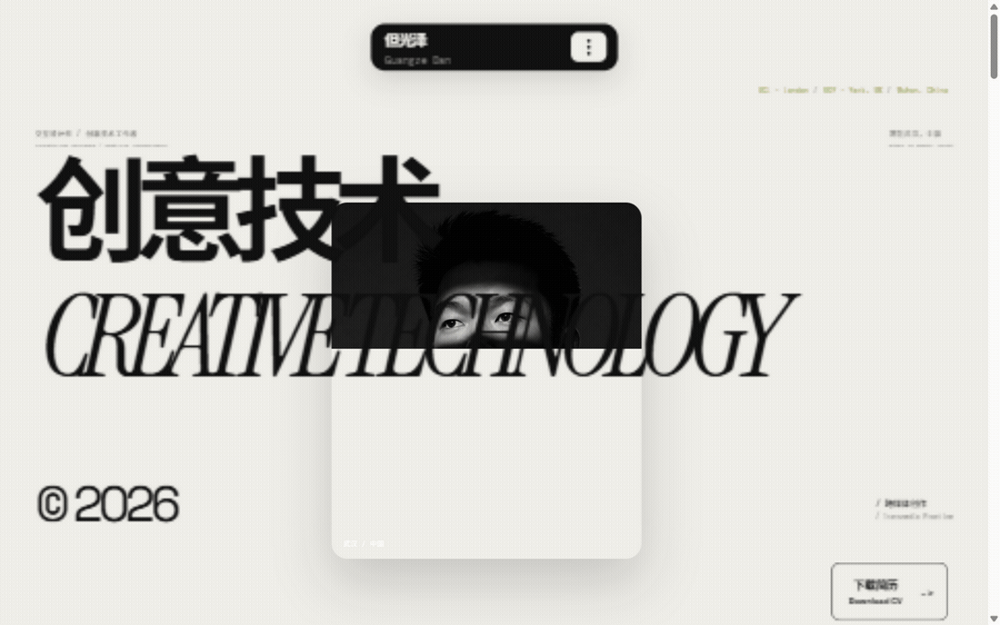

# 但光泽 · Guangze Dan

**交互设计师 / 创意技术工作者** — Interaction Designer / Creative Technologist
专注于游戏、网页体验、视听作品与创意编程等跨媒体实践 · UCL 硕士（伦敦）· 常驻武汉

---

## 🚀 在线预览

[](https://guangze-dan.github.io/)

**网站地址：[https://guangze-dan.github.io/](https://guangze-dan.github.io/)**



---

## 关于我

我是一名交互设计师和创意技术工作者，专注于游戏、网页体验、视听作品与创意编程等跨媒体实践。我在伦敦 UCL 的硕士学习经历，以及在约克积累的创意技术实践，共同构成了我的创作背景。如今以武汉为创作基地，在研究、概念与制作之间探索，创造清晰、有氛围感，并具有人情温度的体验。

## 作品集内容

- **精选作品**：动画影像、游戏世界、博物馆交互、创意编程等 11 个项目
- **作品卡片**：鼠标悬停时播放 GIF 动态预览
- **项目详情**：在线播放视频展示、项目介绍与过程记录

## 技术栈

- React 19 + Vite 6 + Three.js
- GitHub Actions 自动构建部署到 GitHub Pages
- 视频经 H.264 Web 优化压缩（原片备份于本地）

## 本地运行

```bash
npm install
npm run dev
```

打开 `http://127.0.0.1:5174/`。

---

© 2026 但光泽 · 保持好奇，持续创作。
